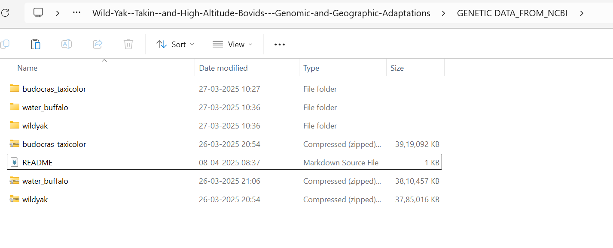

These are the genomes extracted directly from NCBI. Together files are 10.6 GB. Removing those because they're too big for GITHUB

Links to the entire genome assembly for species: 
> https://www.ncbi.nlm.nih.gov/datasets/genome/?taxon=89462 (water buffalo)  
> https://www.ncbi.nlm.nih.gov/datasets/genome/?taxon=9915 (Indicine Cattle) 
> https://www.ncbi.nlm.nih.gov/datasets/genome/?taxon=72004 (wild yak)  
> https://www.ncbi.nlm.nih.gov/datasets/genome/?taxon=37181 (takin)  

