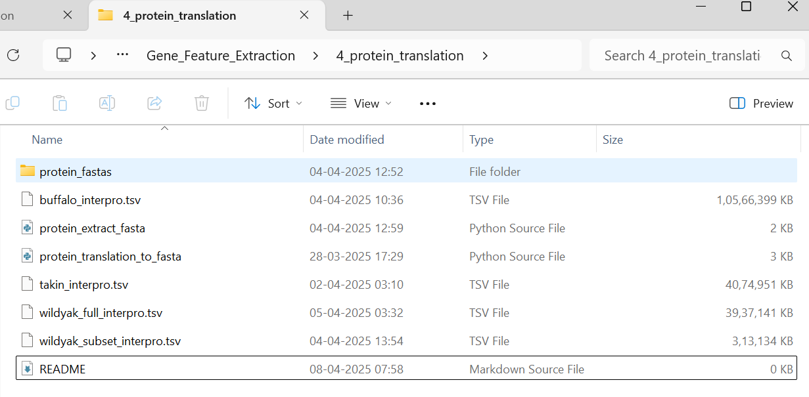
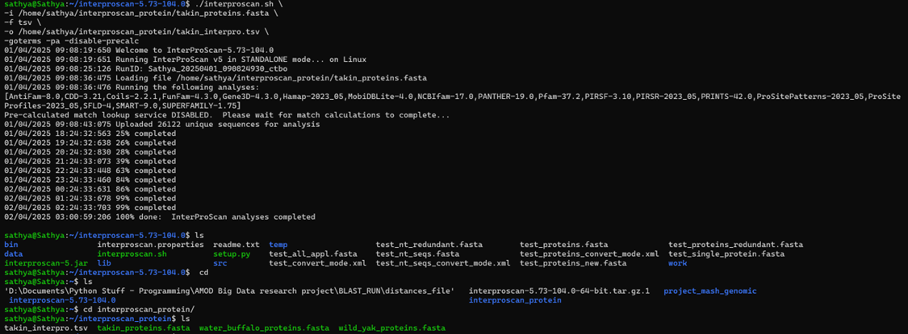
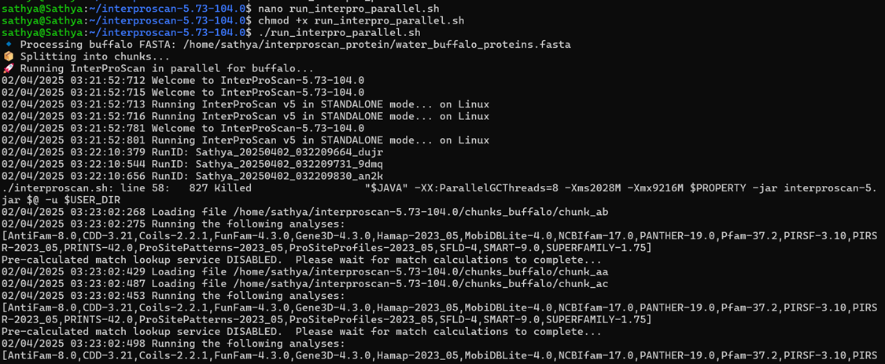
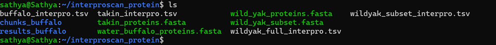

* The file size of **buffalo_interpro.tsv (10 GB), takin_interpro.tsv (3.9 GB), wildyak_full_interpro.tsv (3.8 GB) and wildyak_subset_interpro.tsv (305 MB)** are too large to be kept in the directory. Hence, they will be removed. 

* The only thing was, it took 18.5 hours to generate **takin_interpro.tsv** from interproscan

 

* It took took 53 hours 31 minutes to generate **buffalo_interpro.tsv** (It started on 02/04/2025 at 3:22 am and finished on 04/04/2025 at 8:53 am) 

* It took 8-10 hours to generate **wildyak_full_interpro.tsv**

* Here, using the **protein_extract_fasta.py** to only extract the subset from fasta file (prior to running interproscan) and the **protein_translation_to_fasta.py** extracted features from (gave fasta files for interproscan):

* "Takin": r"D:\Documents\Python Stuff - Programming\AMOD Big Data research project\Wild-Yak--Takin--and-High-Altitude-Bovids---Genomic-and-Geographic-Adaptations\Gene_Feature_Extraction\1_genomic_feature_extraction\takin_genomic_features.csv",

* "Wild Yak": r"D:\Documents\Python Stuff - Programming\AMOD Big Data research project\Wild-Yak--Takin--and-High-Altitude-Bovids---Genomic-and-Geographic-Adaptations\Gene_Feature_Extraction\1_genomic_feature_extraction\wildyak_genomic_features.csv",

* "Water Buffalo": r"D:\Documents\Python Stuff - Programming\AMOD Big Data research project\Wild-Yak--Takin--and-High-Altitude-Bovids---Genomic-and-Geographic-Adaptations\Gene_Feature_Extraction\1_genomic_feature_extraction\waterbuffalo_genomic_features.csv

