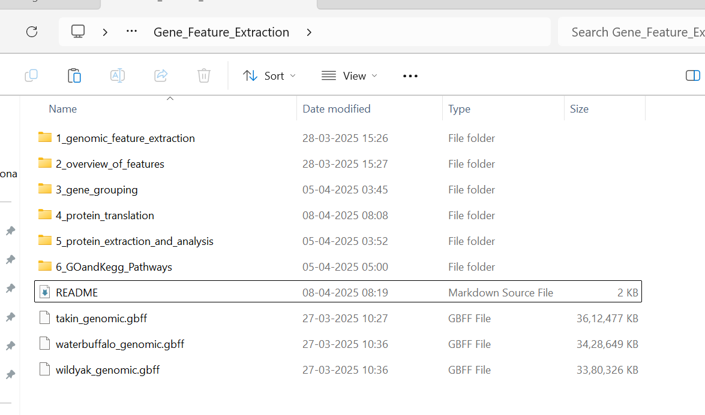

The **takin_genomic.gbff (3.44 GB)**, **waterbuffalo_genomic.gbff (3.26 GB) and wildyak_genomic.gbff (3.22 GB)** are part of the GENOME files downloaded from NCBI

Links to the entire genome assembly for species: 
> https://www.ncbi.nlm.nih.gov/datasets/genome/?taxon=89462 (water buffalo)  
> https://www.ncbi.nlm.nih.gov/datasets/genome/?taxon=9915 (Indicine Cattle) 
> https://www.ncbi.nlm.nih.gov/datasets/genome/?taxon=72004 (wild yak)  
> https://www.ncbi.nlm.nih.gov/datasets/genome/?taxon=37181 (takin)  

