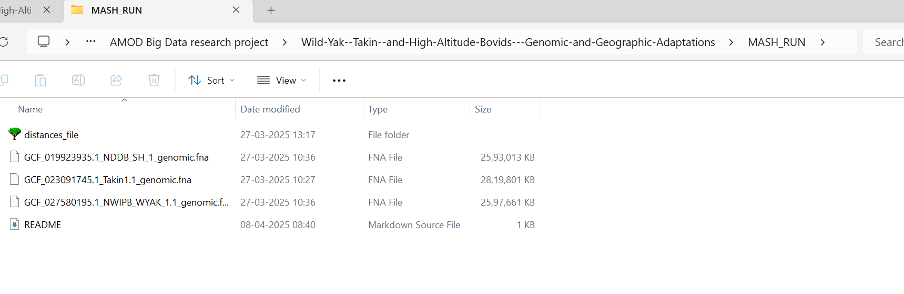

These files are from the GENOME from NCBI, the **.fna files** are taken from the GCF folder

GCA_023091745.2 = version 2 of a GenBank assembly.
**GCF_023091745.1 = version 1 of a RefSeq assembly (reviewed and standardized by NCBI).** <- USED FOR THE PROJECT

Links to the entire genome assembly for species: 
> https://www.ncbi.nlm.nih.gov/datasets/genome/?taxon=89462 (water buffalo)  
> https://www.ncbi.nlm.nih.gov/datasets/genome/?taxon=9915 (Indicine Cattle) 
> https://www.ncbi.nlm.nih.gov/datasets/genome/?taxon=72004 (wild yak)  
> https://www.ncbi.nlm.nih.gov/datasets/genome/?taxon=37181 (takin)  

